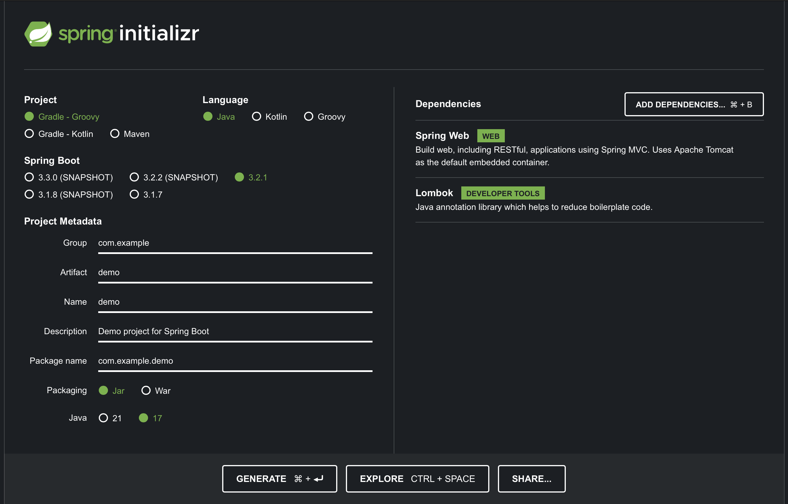

# Spring Java Initializer

## What is Spring?
Spring is a comprehensive framework for Java and Kotlin developed to make it quick and easy to start new applications. Dependencies are easly managed through the use of Gradle or Maven and there are a number of them. This facilitates development because we no longer have to write everything by hand. We can simply import the library and start using it. Spring makes up a rather sizeable portion of the market and there are subsections of Spring that work based on a users needs.

Spring Boot is an extension of Spring that eliminates boiler plate configurations. It takes spring and makes it a little bit easier to work with and facilitates deployments and includes an embedded server with metrics and health checks.

We will be building a sample Spring Java application. We will end up with a simple app with a simple controller.

****
## Project Setup

First things first. Lets start by creating a new repository. Name it something meaningful, ie Spring-Class-Demo, and initialize it with a readme and a gitignore for java. 

Before we clone our repo lets head over to [start.spring.io](https://start.spring.io) and create our skeleton app. 

Use the folowing settings:

- **Project:** Gradle-Groovy (This is the language and package manager used, you can use Maven if you are comfortable with it, but I will be doing gradle)
- **Language:** Java, make sure to select version 21 (at the bottom)
- **Spring Boot:** Leave the default
- **Project Metadata:** Leave default
- **Depedencies:** Add *Spring Web* and *Lombok*

It should look like the following:


Click on **Generate** and the package should download as a zip file. Extract the contents of the file and lets go back to your new empty GitHub repo. 

In your GitHub repo select **Add File** and **Upload File** and upload the created folder. After that you should have in your repo in the root directory 3 things. 
- readme
- .gitignore
- The folder you uploaded

Now we can go ahead and clone the repo into your preferred IDE. If you are trying to get it to work on an online IDE like GitPod, follow the next portion, otherwise you need to use your preferred IDE and you can skip the next step. I will be using 
***
## GitPod Setup

****This is a free IDE for a certain number of hours per month. If you hit this limit you will either have to wait till next month OR you will have to pay for the remainder of the month. You might find other free IDEs like github codespaces.**

From within your browser on GitHub wth your repo open append 
```gitpod.io/#```
to the beginning of the URL so you have something like ```gitpod.io/#https://github.com/Your_User_Name/Your_Repo_Name```

This will open a new window with GitPod. Leave the standard selected with VS Code and the smallest container. 

Once it opens within Gitpod we will be adding 2 extensions by clicking on the *Extensions* button on the left nav and searching for: 
- Extension Pack for Java
- Spring Boot Extension Pack

After this go to the terminal and run the following commands

```console
$ java -version  # outputs a java version, if its not 17 run the following commands

$ sdk list java # Check these list options, you can use 17.0.10-amzn if available if not select another version of 17, jot it down

$ sdk install java 17.0.10-amzn # or any other version 17 you find and want to use
```

Now you should be able to in the terminal run the command the start your app.
```console
$ gradle bootRun
````
What you should then see in the console would be the program running. It will not do much other than start a server, but thats because we dont have any API endpoints. We will be adding some next.

** For other IDEs you will have to find information on how to start a spring boot application. At a minimum you will need Java and maybe to install gradle.
***
## Spring + Gradle

*Note this would be different with Maven*

Looking at our application we created with spring initializer we have the following files with folder names varying slightly depending on your initialized project:
```
demo
├── gradle/wrapper
│   ├── gradle-wrapper.jar
│   ├── gradle-wrapper.properties
├── src
│   ├── main
│   │   ├── java/com/example/demo
│   │   │   ├── DemoApplication.java
│   │   ├── resources
│   │   │   ├── application.properties
│   ├── test/java/com/example/demo
│   │   ├── DemoApplicationTests.java
├── HELP.md
├── build.gradle
├── gradlew
├── gradlew.bat
├── settings.gradle
.gitignore
README.md
```
Some of these are config files we will not be touching in this class because they are more advanced, but I will give you a high level overview. Make sure to read through the additional details within in the [gradle documentation](https://docs.gradle.org/current/userguide/gradle_basics.html).

Starting at the root folder we have the demo folder, that is the folder we unzipped from the initializer. It contains the spring project. Inside of it we have a couple of folders and some additional files.

#### - src/main/java/com/example/demo/**DemoApplication.java**
This is out application. It contains our ```main``` method. 
#### - src/main/resources/**application.properties**
This contains the application specific properties related to running the application in a given environment. This can change on a environment to environment basis. For example you can change the port number within this file by adding *server.port=8081* and the application will start on 8081 instead of 8080 (default)

#### - src/test/java/com/example/demo/**DemoApplicationTests.java**
This file contains Junit tests. In this case its empty because we havent written in the application. We would need to write code and start populating tests. 

#### HELP.md
THis is just informational. Contains some potentially useful links to documentation.

#### build.gradle
This is where the heavy lifting and magic of the framework happens. Your dependency imports, scripts for testing or other needed build actions occur here. It is written in Groovy and can perform a number of tasks. For some additional information see this [article](https://medium.com/@andrewMacmurray/a-beginners-guide-to-gradle-26212ddcafa8).

#### gradle/wrapper/* && gradlew && gradlew.bat
It is a wrapper for gradle that ensures we are using one specific version of gradle by specifying which version to download and install. **gradle-wrapper.properties** will contain the information about the gradle distribution. You can invoke the gradle wrapper by using the following command in the terminal
```console
$ ./gradlew build # non-windows
$ ./gradlew.bat build # windows
```

#### settings.gradle
The settings file defines the structure of the project by including subprojects, if there are any

You now have a running Spring Web Project.
See the following repo for the next steps.
